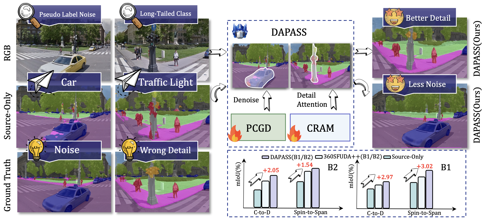

# DAPASS: Denoise and Align: Towards Source-Free UDA for Robust Panoramic Semantic Segmentation

This is the official PyTorch implementation of the following publication:

> **DAPASS: Denoise and Align: Towards Source-Free UDA for Robust Panoramic Semantic Segmentation**<br/>
> [Yaowen Chang](), [Zhen Cao](), [Xiaoxin Mi](), [Zheng Xu](), [Zhen Dong](https://dongzhenwhu.github.io/index.html)
> *arXiv 2026*<br/>
> [**Full Paper**](https://arxiv.org/abs/2603.25131) | [**Webpage**]() | [**Dataset**]()

## Introduction

> **TL;DR:** DAPASS achieves state-of-the-art performances on outdoor (Cityscapes-to-DensePASS) and indoor (Stanford2D3D) benchmarks, yielding **55.04% (+2.05%)** and **70.38% (+1.54%)** mIoU, respectively.



**Abstract:** Panoramic semantic segmentation is pivotal for comprehensive 360° scene understanding in critical applications like autonomous driving and virtual reality. However, progress in this domain is constrained by two key challenges: the severe geometric distortions inherent in panoramic projections and the prohibitive cost of dense annotation. While Unsupervised Domain Adaptation (UDA) from label-rich pinhole-camera datasets offers a viable alternative, many real-world tasks impose a stricter source-free (SFUDA) constraint where source data is inaccessible for privacy or proprietary reasons. This constraint significantly amplifies the core problems of domain shift, leading to unreliable pseudo-labels and dramatic performance degradation, particularly for minority classes. To overcome these limitations, we propose the DAPASS framework. DAPASS introduces two synergistic modules to robustly transfer knowledge without source data. First, our Panoramic Confidence-Guided Denoising (PCGD) module generates high-fidelity, class-balanced pseudo-labels by enforcing perturbation consistency and incorporating neighborhood-level confidence to filter noise. Second, a Cross-Resolution Attention Module (CRAM) explicitly addresses scale variance and distortion by adversarially aligning fine-grained details from high-resolution crops with global semantics from low-resolution contexts. DAPASS achieves state-of-the-art performances on outdoor (Cityscapes-to-DensePASS) and indoor (Stanford2D3D) benchmarks, yielding **55.04% (+2.05%)** and **70.38% (+1.54%)** mIoU, respectively.

## Update

- 2026-02-22: The paper was accepted to CVPR26!
- 2026-02-15: Code of Evaluation is available!
- 2025-11-12: Paper was submitted to CVPR26.

## Requirements

The code has been tested on:
- Ubuntu 20.04
- CUDA 11.2
- Python 3.8.19
- Pytorch 1.8.0
- GeForce RTX 3090.

## Environments

```bash
conda create -n DAPASS python=3.8
conda activate DAPASS
cd ~/path/to/DAPASS 
conda install pytorch==1.8.0 torchvision==0.9.0 torchaudio==0.8.0 cudatoolkit=11.1 -c pytorch -c conda-forge
pip install mmcv-full==1.3.9 -f https://download.openmmlab.com/mmcv/dist/cu111/torch1.8.0/index.html
pip install -r requirements.txt
python setup.py develop --user
# Optional: install apex follow: https://github.com/NVIDIA/apex
```

## Data Preparation

Prepare datasets: 
- [Cityscapes](https://www.cityscapes-dataset.com/)
- [DensePASS](https://github.com/chma1024/DensePASS)
- [Stanford2D3D](https://arxiv.org/abs/1702.01105)
```
datasets/
├── cityscapes
│   ├── gtFine
│   └── leftImg8bit
├── Stanford2D3D
│   ├── area_1
│   ├── area_2
│   ├── area_3
│   ├── area_4
│   ├── area_5a
│   ├── area_5b
│   └── area_6
├── DensePASS
│   ├── gtFine
│   └── leftImg8bit
```
## Citations

If you find this project helpful, please consider citing the following paper:
```
@article{chang2026denoise,
  title={Denoise and Align: Towards Source-Free UDA for Robust Panoramic Semantic Segmentation},
  author={Chang, Yaowen and Cao, Zhen and Zheng, Xu and Mi, Xiaoxin and Dong, Zhen},
  journal={arXiv preprint arXiv:2603.25131},
  year={2026}
}
```

## TODO list

- [ ] Release training code
- [ ] Release evaluation code
- [ ] Release the copy-paste pool for evaluation
- [ ] Release preprocessed datasets and pretrained models

This repository is still under construction. Please feel free to open issues or submit pull requests. We appreciate all contributions to this project.
